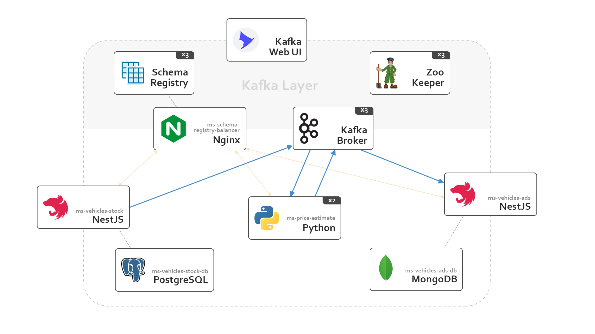

# Microservices architecture with NestJS, Python and Kafka

The goal of this project is to practice a microservices architecture based on **Apache Kafka** with services written in different languages — **TypeScript** and **Python** — that communicate between them. The Kafka layer is configured to have a basic level of redundancy, with each component running on three instances.

In total, the system is composed of 17 containers:
- 3x **Apache Kafka** brokers
- 3x **ZooKeeper** instances to orchestrate the Kafka infrastructure
- 3x **Schema Registry** instances
- 1x **NGINX** load balancer for Schema Registry
- 1x **Apache Kafka UI**, a web-app to better interact with Kafka (exposed on http://localhost:8080, credentials `admin:password`)
- 1x **NestJS** instance for the `vehicles-stock` service (exposed on http://localhost:3002)
- 1x **PostgreSQL** database for the previous service
- 2x **Python** instances for the `price-estimate` service
- 1x **NestJS** instance for the `vehicles-ads` service (exposed on http://localhost:3003)
- 1x **MongoDB** database for the previous service



## Services

### vehicles-stock
This service exposes an HTTP REST API that allows users to create and list vehicles, and is also a **Kafka producer**.

A POST request to `http://localhost:3002/stock` with the following body
```json
{
  "vin": "vin",
  "model": "model",
  "manufacturer": "manufacturer",
  "year": 2022,
  "odometer": 1000,
  "odometerUnit": "odometerUnit"
}
```
creates a new vehicle in the local Postgres database and emits data to the `stock.vehicle-created` topic in Kafka.

A GET request to `http://localhost:3002/stock` retrieves vehicles.

### price-estimate
This service consumes `stock.vehicle-created` to calculate a price for vehicles. The calculation simply generates a random number after 30 seconds to simulate some form of processing.

When done, it emits the vehicle with its price to the `stock.vehicle-processed` topic in Kafka. This service is **both a consumer and a producer**.

### vehicles-ads
This service only exposes an HTTP endpoint to get a list of ads — `http://localhost:3003/ads` — and is a **Kafka consumer**: it consumes `stock.vehicle-processed` to create vehicle ads in the local MongoDB database.

## Schema registry

Messages are encoded and decoded using **JSON schemas** registered on the schema registry, to enforce structure: each topic requires messages to conform to a specific schema, and trying to emit one that does not will result in an error.

Currently each service registers its own schema, so common schemas may be duplicated across services — this can be improved.

## Startup

Run `docker compose up -d` to create the infrastructure and start the containers; the process may take some time. A few services need to wait for the schema registry servers to be up, so they use a *wait-for* script with a timeout of 90 seconds.

The following services will then be exposed to the host machine:

- Kafka Web UI on `http://localhost:8080` (use `admin:password` to access it)
- Vehicles stock service on `http://localhost:3002`
- Vehicles ads service on `http://localhost:3003`